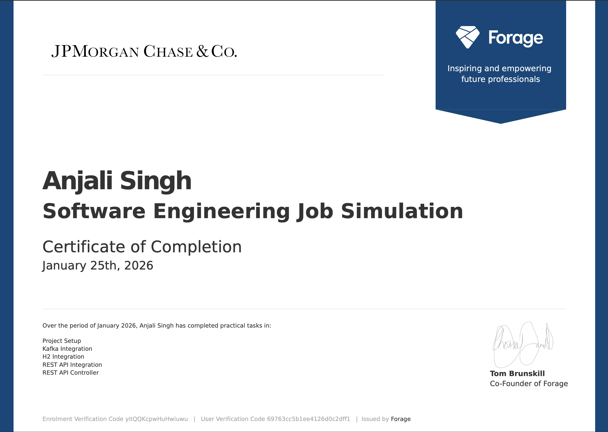

# JPMorgan Chase Software Engineering Virtual Experience

JPMorganChase Software Engineering Job Simulation on Forage - January 2026

- Integrated Kafka into a Spring Boot microservice to consume and deserialize
  high-volume transaction messages using a configurable topic and embedded
  Kafka test framework.
- Implemented transaction validation and persistence logic with Spring Data JPA
  and an H2 SQL database, including entity modeling and balance updates across
  relational User records.
- Connected the service to an external REST Incentive API using RestTemplate,
  processing incentive responses and incorporating them into transactional
  workflows.
- Developed a REST endpoint for querying user balances, returning JSON
  responses through a Spring controller while maintaining clean architectural
  boundaries.
- Verified system behavior using Maven test suites and debugger-driven
  inspection, ensuring reliability across message ingestion, database
  operations, and external API interactions.

I recently participated in JPMorganChase’s job simulation on the Forage
platform, and it was incredibly useful to understand what it might be like to
participate on a backend engineering team at JPMorganChase.
I worked on a project to build out key components of the Midas
transaction-processing system, integrating Kafka, a SQL database, and an
external REST API into a cohesive Spring Boot service. I practiced using Java,
Spring Boot, Kafka, and SQL, and built my backend development and distributed
systems skills in a real-world context.
Doing this program confirmed that I really enjoy working on scalable system
design, data processing pipelines, and API-driven architectures, and I'm excited
to apply these skills on a backend engineering team at a company like
JPMorganChase.

## Project: Midas Core

A financial transaction processing system integrating Kafka, SQL Database, and REST APIs.

## Tasks

| Task                  | Title                | Status    |
| --------------------- | -------------------- | --------- |
| [Task 1](./task-1.md) | Project Setup        | Completed |
| [Task 2](./task-2.md) | Kafka Integration    | Completed |
| [Task 3](./task-3.md) | H2 Integration       | Completed |
| [Task 4](./task-4.md) | REST API Integration | Completed |
| [Task 5](./task-5.md) | REST API Controller  | Completed |

## Repository

[https://github.com/iamanjali1003/forage-midas](https://github.com/iamanjali1003/forage-midas)

## Certificate

## License

[MIT](https://github.com/iamanjali1003/forage-jpmc-virtual-experience/blob/main/LICENSE)
