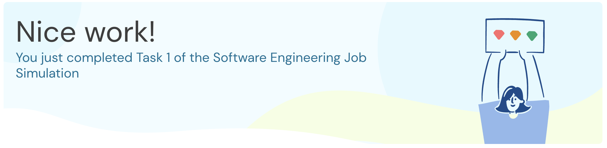

# Task 1: Project Setup

**Duration:** 30-60 mins | **Status:** Completed

## Objective

Set up local development environment and prepare the Midas Core project scaffold for future integration tasks.

## What I Did

### 1. Forked and Cloned Repository

Forked [https://github.com/iamanjali1003/forage-midas](https://github.com/iamanjali1003/forage-midas) and set up local development environment.

### 2. Added Dependencies to `pom.xml`

| Dependency               | Purpose                  |
| ------------------------ | ------------------------ |
| Lombok                   | Reduces boilerplate code |
| MapStruct                | Object mapping           |
| Spring Kafka             | Kafka integration        |
| Spring Data JPA          | Database access          |
| H2 Database              | In-memory SQL database   |
| Spring Web               | REST API support         |
| Spring Boot Starter Test | Testing framework        |

### 3. Updated `application.yml`

Added `kafka-topic` property for transaction processing configuration.

## Quiz Answer

**Q: What output do you see when running TaskOneTests?**

**A: 1142725631254665682354316777216387420489**

## Pull Request

[PR #1: feat(task-1): add project dependencies and kafka config](https://github.com/iamanjali1003/forage-midas/pull/1)

## Skills Practiced

- Java Programming
- Build Tools (Maven)
- Spring Framework
