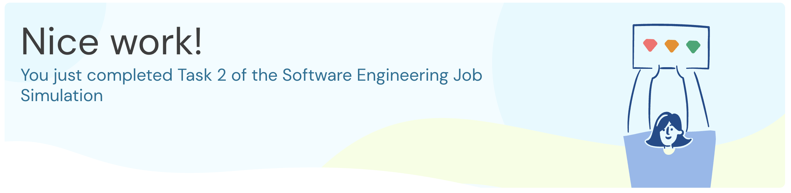

# Task 2: Kafka Integration

**Duration:** 30-60 mins | **Status:** Completed



## Objective

Integrate Apache Kafka into Midas Core to receive incoming transactions via a message queue.

## What I Learned

- How message queues (Kafka) decouple services and enable asynchronous communication
- How to integrate Kafka into a Spring Boot application using `@KafkaListener`
- How to deserialize incoming Kafka messages into domain objects

## What I Did

### 1. Created Kafka Configuration

Created `KafkaConfig.java` with:

- Producer factory with JSON serializer
- Consumer factory with JSON deserializer
- Kafka listener container factory

### 2. Implemented Transaction Listener

Created `TransactionListener.java` component:

```java
@Component
public class TransactionListener {
    @KafkaListener(topics = "${general.kafka-topic}")
    public void listen(Transaction transaction) {
        logger.info("Received transaction: {}", transaction);
    }
}
```

### 3. Ran Tests and Verified Integration

Executed `TaskTwoTests` to verify Kafka integration with embedded Kafka instance.

## Quiz Answer

**Q: What list reflects the amount attached to the first four transactions received by Midas Core?**

**A: 122.86, 42.87, 161.79, 22.22**

## Pull Request

[PR #2: feat(task-2): add kafka consumer for transaction processing](https://github.com/iamanjali1003/forage-midas/pull/2)

## Skills Practiced

- Message Queuing (Kafka)
- Spring Framework
- Java Programming
