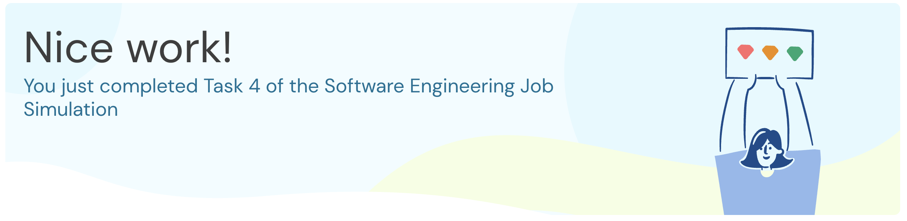

# Task 4: REST API Integration

**Duration:** 30-60 mins | **Status:** Completed



## Objective

Integrate Midas Core with an external Incentive API to reward valid transactions.

## What I Learned

- How to integrate a Spring application with an external REST API using RestTemplate
- How REST APIs act as contracts between decoupled components
- How to handle request/response patterns in microservices architecture

## What I Did

### 1. Created Incentive Class

Created `Incentive.java` to deserialize API response:

```java
@JsonIgnoreProperties(ignoreUnknown = true)
public class Incentive {
    private float amount;
}
```

### 2. Created IncentiveService

Created service to call the external Incentive API:

```java
@Service
public class IncentiveService {
    private static final String INCENTIVE_API_URL = "http://localhost:8080/incentive";

    public float getIncentive(Transaction transaction) {
        Incentive incentive = restTemplate.postForObject(INCENTIVE_API_URL, transaction, Incentive.class);
        return incentive != null ? incentive.getAmount() : 0f;
    }
}
```

### 3. Updated TransactionRecord

Added `incentive` field to store the incentive amount alongside each transaction.

### 4. Updated Balance Logic

- Sender balance: decreased by transaction amount
- Recipient balance: increased by transaction amount + incentive amount

## Quiz Answer

**Q: What is the balance of the "wilbur" user after all transactions are processed (rounded down)?**

**A: 3089**

## Pull Request

[PR #4: feat(task-4): add incentive API integration](https://github.com/iamanjali1003/forage-midas/pull/4)

## Skills Practiced

- REST API Integration
- Spring Framework (RestTemplate)
- Java Programming
