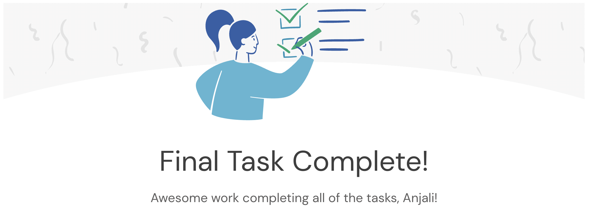

# Task 5: REST API Controller

**Duration:** 1-2 hours | **Status:** Completed



## Objective

Expose a REST API endpoint in Midas Core for querying user balances.

## What I Learned

- How to expose REST API endpoints within a Spring Boot application
- How to design user-facing APIs that surface data from a backend system
- How REST controllers integrate alongside Kafka listeners and database layers
- Architectural trade-offs when adding functionality to existing services

## What I Did

### 1. Configured Server Port

Updated `application.yml` to run on port 33400:

```yaml
server:
  port: 33400
```

### 2. Created Balance Controller

Created `BalanceController.java` with GET `/balance` endpoint:

```java
@RestController
public class BalanceController {

    @GetMapping("/balance")
    public Balance getBalance(@RequestParam Long userId) {
        UserRecord user = userRepository.findById(userId.longValue());
        if (user == null) {
            return new Balance(0);
        }
        return new Balance(user.getBalance());
    }
}
```

## Quiz Answer

**Q: Submit the TaskFiveTests output (including begin and end tags)**

**A:**

```
---begin output ---
Balance {amount=0.0}
Balance {amount=1326.98}
Balance {amount=2567.52}
Balance {amount=2740.33}
Balance {amount=140.96999}
Balance {amount=10.419973}
Balance {amount=845.49005}
Balance {amount=657.49}
Balance {amount=99.189995}
Balance {amount=3434.0002}
Balance {amount=2157.1902}
Balance {amount=779421.3}
Balance {amount=0.0}
---end output ---
```

## Pull Request

[PR #5: feat(task-5): add balance REST API endpoint](https://github.com/iamanjali1003/forage-midas/pull/5)

## Skills Practiced

- REST API Development
- Spring Framework
- Java Programming
